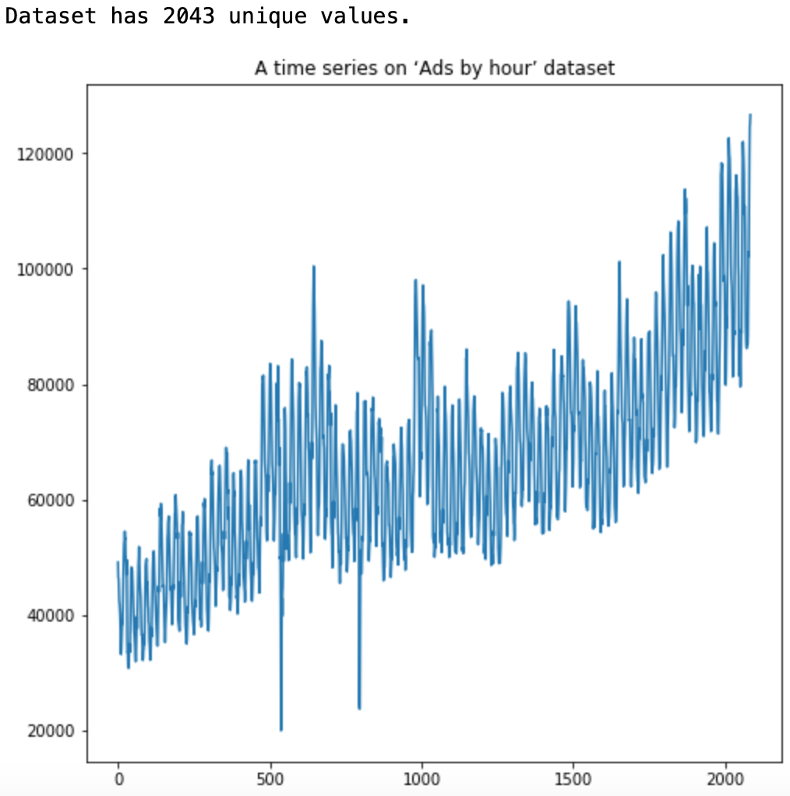
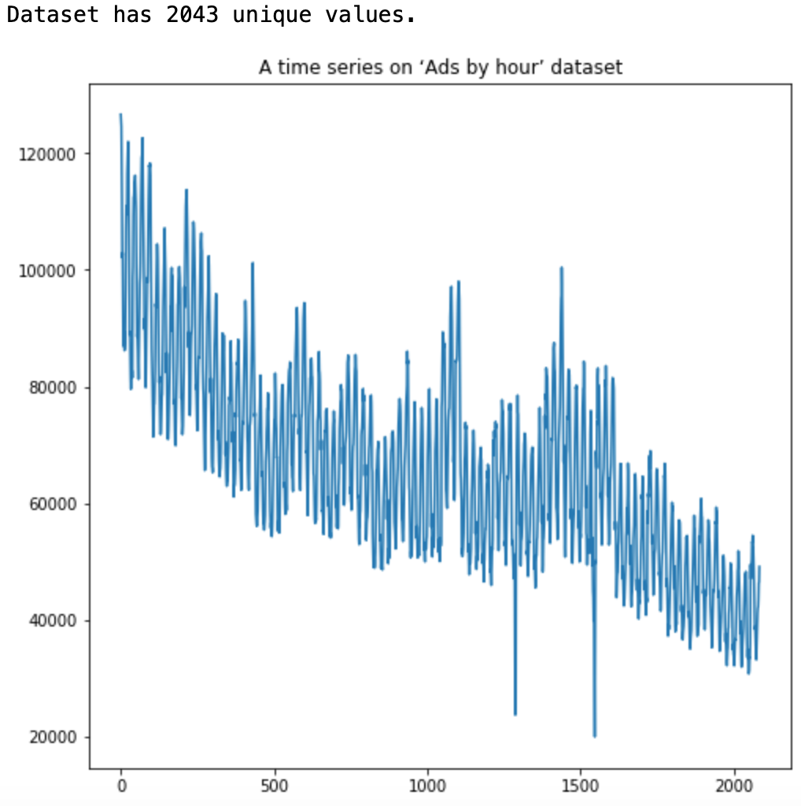
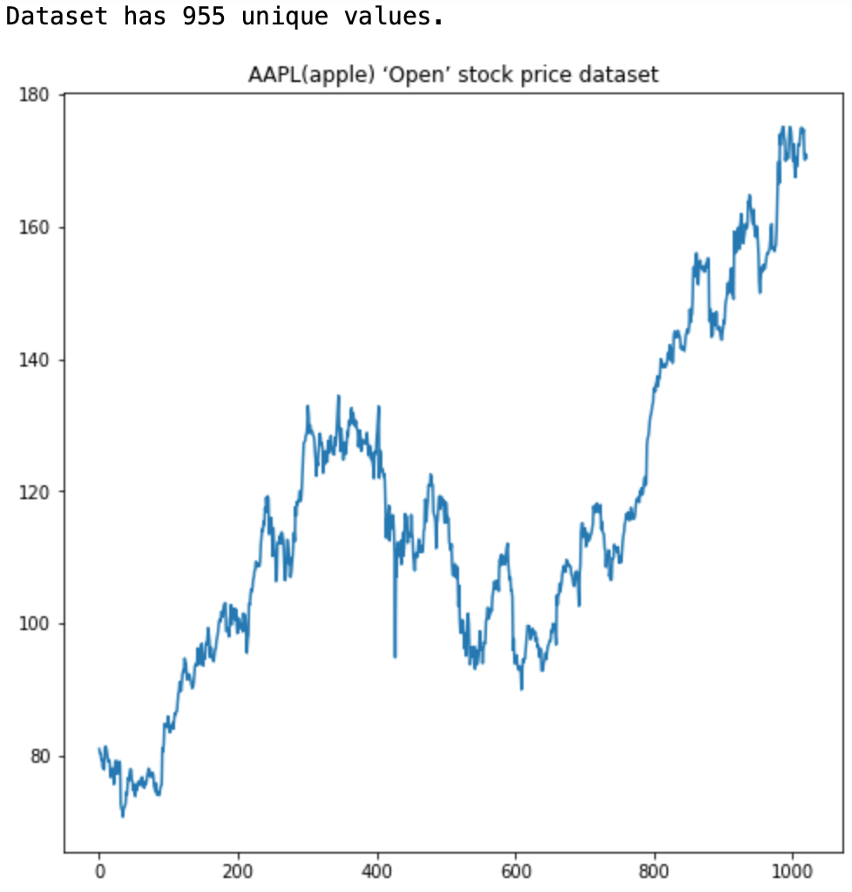

# camera-app


<p align="middle">
 </img>
 </img>
 </img>
 </img>
</p>

<table>
<tr>
<th align="center">

<p> 
<small>
EXAMPLE TEXT
</small>
</p>
</th>
<th align="center">

<p> 
<small>
EXAMPLE TEXT
</small>
</p>
</th>
</tr>
<tr>
<td>
<!-- REMOVE THE BACKSLASHES -->
\```jsonc
{
  "foo": [
    {
      "bar": "hello world"
    }
  ]
}
\```
  
</td>
<td>
<!-- REMOVE THE BACKSLASHES -->
\```jsonc
{
  "foo": [
    {
      "bar": "hello world"
    }
  ]
}
\```
  
</td>
</tr>
<tr>
<td align="center">
Column 1
</td>
<td align="center">
Column 2
</td>
</tr>
</table>
<figure class="image">
  
  <figcaption>{{ include.description }}</figcaption>
</figure>


<figure class="image">
 <</img>
 </img>
 </img>
 </img>
 <figcaption>{{ include.descriptionsdalkfndslkfnlsdknflkdsnflksdnflksdfnlksdnfksdlflndskl }}</figcaption>
</figure>
