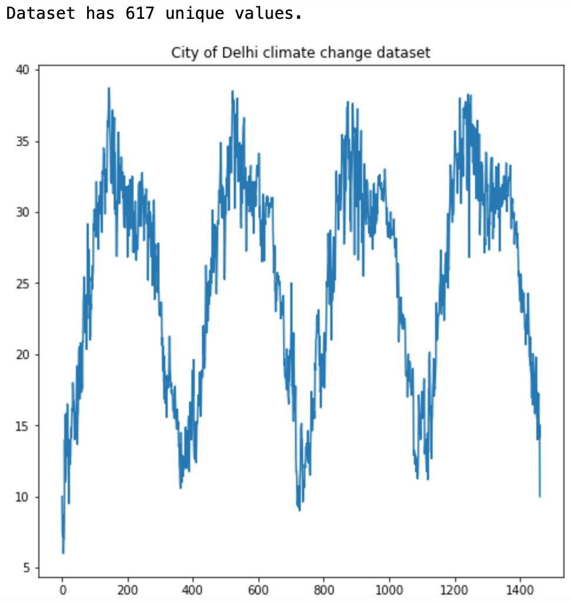
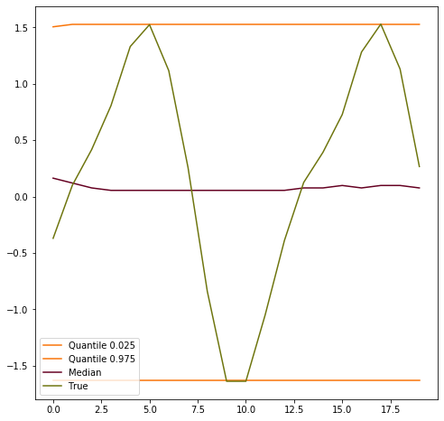
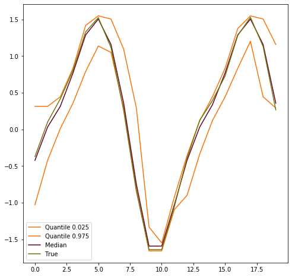
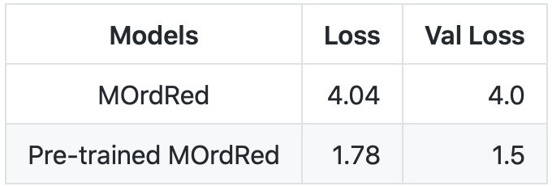

# camera-app

 </img>
 <em>**Fig.1:** Input data</em>
 </img>
 <em>**Fig.1:** Input data</em>
 </img>
 <em>**Fig.1:** Input data</em>
 </img>
 <em>**Fig.1:** Input data</em>

 </img>
 <em>**Fig.1:** Input data</em>
 </img>
 <em>**Fig.1:** Input data</em>
 </img>
 <em>**Fig.1:** Input data</em>
 </img>
 <em>**Fig.1:** Input data</em>

| </img> | </img>  | </img>  | </img>  | 
|:--:| :--:| :--:| :--:| 
| **Fig.1:** Input data | **Fig.2:** MOrdRed_median | **Fig.3:** Pre-trained MOrdReD_median | **Fig.4:** Result table |

 </img>
 </img>
 </img>
 </img>

    <em>**Fig.1:** Input data</em>
    <em>**Fig.2:** MOrdRed_median</em>
    <em>**Fig.3:** Pre-trained MOrdReD_median</em>
    <em>**Fig.4:** Result table</em>

<table>
<tr>
<th align="center">

 
<small>
EXAMPLE TEXT
</small>

</th>
<th align="center">

 
<small>
EXAMPLE TEXT
</small>

</th>
<th align="center">

 
<small>
EXAMPLE TEXT
</small>

</th>
<th align="center">

 
<small>
EXAMPLE TEXT
</small>

</th>
</tr>
</table>

    

    <em>**Fig. 1:** Image caption</em>

<figure class="image">
  
  <figcaption>{{ include.description }}</figcaption>
</figure>

<figure class="image">
 <</img>
 </img>
 </img>
 </img>
 <figcaption>{{ include.descriptionsdalkfndslkfnlsdknflkdsnflksdnflksdfnlksdnfksdlflndskl }}</figcaption>
</figure>
